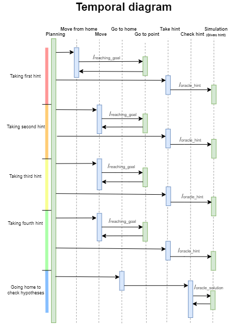
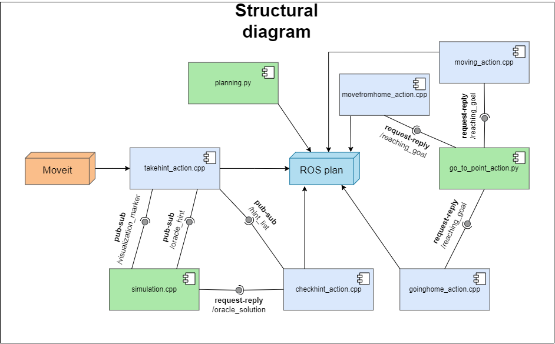

# Experimental Robotics Laboratory - Second assignment
Maria Luisa Aiachini - 4375373

### General introduction
This project simulates a simple version of cluedo. The robot is inside a room enclosed by four walls; the robot needs to go around the room, searching for some hints and then, when it has a complete and consistent hypothesis it needs to check if it is the winning one; if it is the winning one the simulation stops, if not, the robot goes back to find new hints.
The hints the robot has to take, are placed in defined positions: (3,0)(-3,0)(0,3)(0,-3), but the height of the hint is randomly chosen, at the start of the simulation, between two positions: 0.75 and 1.25; this means that the robot is able to move the arm to these two positions to take the hints.

### Expected behavior

The robot, once sthe simulation starts execute always the same order of actions:
- Goes from home to the first waypoint
- Tries to take the first hint at the waypoint trying both the possible height
- Goes to the frollowing waypoints
- At avery waypoint tries both heights to take the hints
- Goes back to home
- Checks if there is a complete and consistent hypotheses
- If yes checks if they are the winning one, if not the behaviour starts from the beginning (this time the height at avery waypoint is known, it will go directly there)
- If yes the game ends, if not the game starts from the beginning (this time the height at avery waypoint is known, it will go directly there)

### Software architecture


For this project are needed three packages:
- [erl2](https://github.com/Marilwoo/exprob_2/tree/master/erl2) This node contains:
	- Main launch file for the project
	- [Go_to_point.py](https://github.com/Marilwoo/exprob_2/blob/master/erl2/scripts/go_to_point_action.py) script for managing the robot movement:
	contains a state machine that makes the robot move. It contains:
		- Publisher to `cmd_vel` for publishing the movement's velocities
		- Subscriber to `/odom` to retrieve the robot position and orientation
		- Action server to `/reaching_goal` to make the robot start move and give feedback about the reaching of the target
	- [Planning](https://github.com/Marilwoo/exprob_2/blob/master/erl2/scripts/planning.py) script for managing the replanning when the plan does not end with a success
	- [Simulation](https://github.com/Marilwoo/exprob_2/blob/master/erl2/src/simulation.cpp) file that manages the position and the sending of the hints.
	- [Urdf and xacro](https://github.com/Marilwoo/exprob_2/tree/master/erl2/urdf) files for the robot
	- Pddl files for [domain](https://github.com/Marilwoo/exprob_2/blob/master/erl2/pddl/domain.pddl) and [problem](https://github.com/Marilwoo/exprob_2/blob/master/erl2/pddl/problem.pddl)
	- [Documentation](https://github.com/Marilwoo/exprob_2/tree/master/erl2/docs/html)
- [my_rosplan_interface](https://github.com/Marilwoo/exprob_2/tree/master/my_rosplan_interface): this node the action files for the ROSplan:
	- [Move from home](https://github.com/Marilwoo/exprob_2/blob/master/my_rosplan_interface/src/movefromhome_action.cpp): this node is used for defining the action that makes the robot move from home to any of the waypoints. When this node is called from the ROSplan it defines the target position and orientation the robot should have in order to reach the chosen waypoint. It also contains the Action client to `/reaching_goal` to call the go_to_point node.
	- [Moving action](https://github.com/Marilwoo/exprob_2/blob/master/my_rosplan_interface/src/moving_action.cpp): this node is the same as the one before.
	- [Going home](https://github.com/Marilwoo/exprob_2/blob/master/my_rosplan_interface/src/goinghome_action.cpp): this node is the same as the one before.
	- [Take hint](https://github.com/Marilwoo/exprob_2/blob/master/my_rosplan_interface/src/takehint_action.cpp): this node implements the behaviour to make the robot take the hints. It contains:
		- Subscriber to `/visualization_marker` to retreive the position of the markers
		- Subscriber to `/oracle_hint` that is the topic on which the hints are received
		- Publisher to `/hint_list` that publishes the complete list of hypothesis gathered
	- [Check hint](https://github.com/Marilwoo/exprob_2/blob/master/my_rosplan_interface/src/checkhint_action.cpp): this node is used to check if the hypotheses received are complete (containing three hints) and consistent (one hint of every type: Person, Place, Weapon). It then checks if the hypothesis is the winning one. It contains:
		- Subscriber to `hint_list` to retreive the gathered hypotheses
		- Client to `oracle_solution` that respond with the winning ID
	- [Documentation](https://github.com/Marilwoo/exprob_2/tree/master/my_rosplan_interface/docs/html)
- [exprob_2_moveit](https://github.com/Marilwoo/exprob_2/tree/master/exprob_2_moveit)
	- [Configuration files](https://github.com/Marilwoo/exprob_2/tree/master/exprob_2_moveit/config) for moveit
	- [Launch](https://github.com/Marilwoo/exprob_2/tree/master/exprob_2_moveit/launch) files for moveit
	
#### ROS msgs
- ErlOracle.msg
	```
	int32 ID
	string key
	string value
	```
- hints.msg
	```
	string[] hint_0
	string[] hint_1
	string[] hint_2
	string[] hint_3
	string[] hint_4
	string[] hint_5
	```
#### ROS srv
- Check_srv.srv
	```
	string ID_srv
	---
	bool check
	```
- Oracle.srv
	```
	---
	int32 ID
	```

### Installation and how to run
For this project to work are needed:
- The three packages 
	- [erl2](https://github.com/Marilwoo/exprob_2/tree/master/erl2)
	- [my_rosplan_interface](https://github.com/Marilwoo/exprob_2/tree/master/my_rosplan_interface)
	- [exprob_2_moveit](https://github.com/Marilwoo/exprob_2/tree/master/exprob_2_moveit)
	
These packages need to be cloned in your ros_ws ROS workspace

- ROSplan

To build the code run:

	catkin_make -DCATKIN_WHITELIST_PACKAGES=""
	
To run the code in a terminal run:
	
	roslaunch erl2 mylaunch.launch
	
	
### Working description, screenshots

### System features

### System limitations

### Possible improvements

### Contacts
Maria Luisa Aiachini - 4375373

4375373@studenti.unige.it
